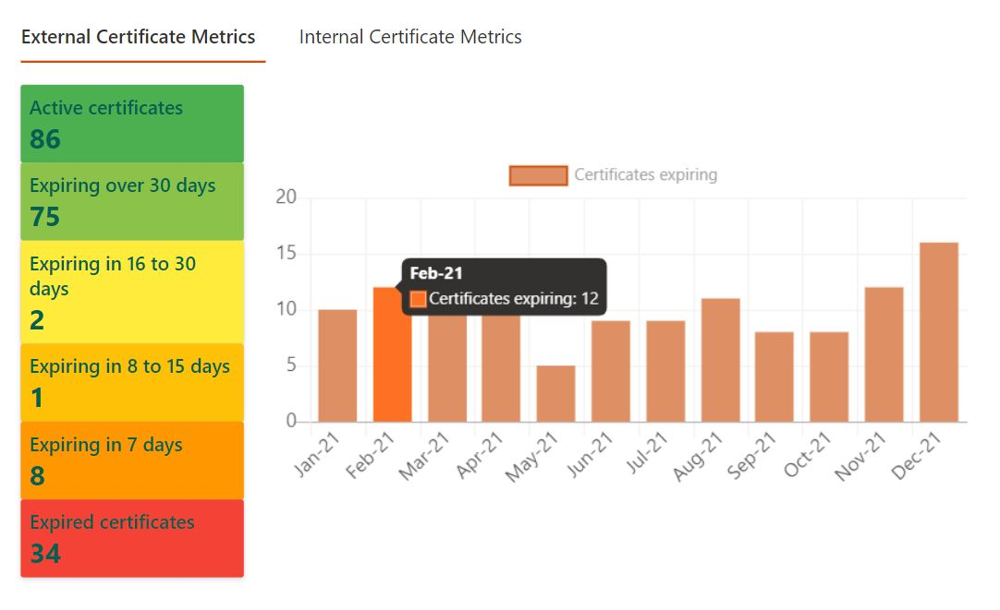
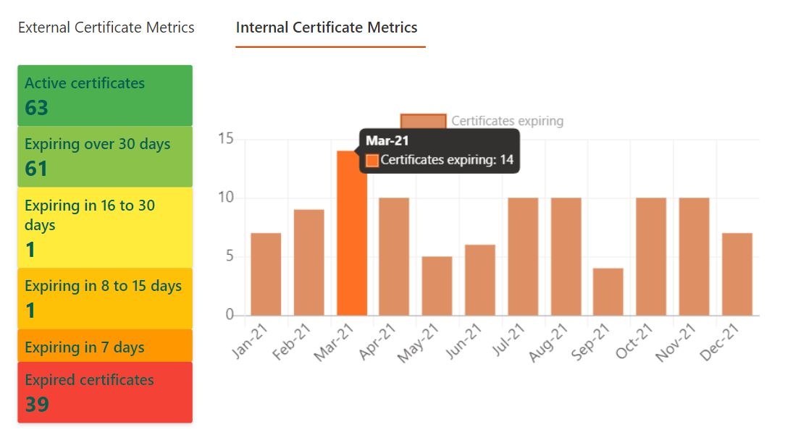

# certificate-renewal-dashboard-webpart

## Summary

This web part was designed using SharePoint Framework (SPFX) and React JS.  
It provides a dashboard view of the SSL certificates expiring in the current year.  
The dashboard has two components -

- **Bar Chart** - displays the count of certificates expiring vs month
- **Red-Yellow-Green (RGB)** - displays the count of certificates expiring in the coming days

This dashboard allowed the team to efficiently plan the renewal/revocation of SSL certificates ahead of time.

 

## Output

- **External Certificate Dashboard**

  
    

- **Internal Certificate Dashboard**

  

 

## Used SharePoint Framework Version

 

## Adhoc Frameworks/Components used:

- React JS
- Chart JS
- PNP SPFX Controls React
- Fluent UI (Office UI Fabric)

 

## Applies to

- [SharePoint Framework](https://aka.ms/spfx)
- [Microsoft 365 tenant](https://docs.microsoft.com/en-us/sharepoint/dev/spfx/set-up-your-developer-tenant)

 

## Prerequisites

- Node v10.x.x
- SharePoint lists with below schema -
  | List Name             | Columns               |
  | --------------------- | --------------------- |
  | External Certificates | Title, ExpirationDate |
  | Internal Certificates | Title, ExpirationDate |

 

## Solution

| Solution                              | Author(s)  |
| ------------------------------------- | ---------- |
| certificate-renewal-dashboard-webpart | Mayur Mule |

 

## Version history

| Version | Date             | Comments        |
| ------- | ---------------- | --------------- |
| 1.0     | December 1, 2020 | Initial release |

 

## Disclaimer

**THIS CODE IS PROVIDED _AS IS_ WITHOUT WARRANTY OF ANY KIND, EITHER EXPRESS OR IMPLIED, INCLUDING ANY IMPLIED WARRANTIES OF FITNESS FOR A PARTICULAR PURPOSE, MERCHANTABILITY, OR NON-INFRINGEMENT.**

---

 

## Minimal Path to Awesome

- Ensure that installed Node version is v10.x.x
- Clone this repository
- Ensure that you are at the solution folder
- In the command-line run:
  - **npm install**
  - **gulp serve** [for dev workbench]
  - **gulp bundle --ship && gulp package-solution --ship** [for prod build]

 

## References

- [Getting started with SharePoint Framework](https://docs.microsoft.com/en-us/sharepoint/dev/spfx/set-up-your-developer-tenant)
- [Building for Microsoft teams](https://docs.microsoft.com/en-us/sharepoint/dev/spfx/build-for-teams-overview)
- [Use Microsoft Graph in your solution](https://docs.microsoft.com/en-us/sharepoint/dev/spfx/web-parts/get-started/using-microsoft-graph-apis)
- [Publish SharePoint Framework applications to the Marketplace](https://docs.microsoft.com/en-us/sharepoint/dev/spfx/publish-to-marketplace-overview)
- [Microsoft 365 Patterns and Practices](https://aka.ms/m365pnp) - Guidance, tooling, samples and open-source controls for your Microsoft 365 development
- [Reusable React controls for your SharePoint Framework solutions](https://pnp.github.io/sp-dev-fx-controls-react/)
